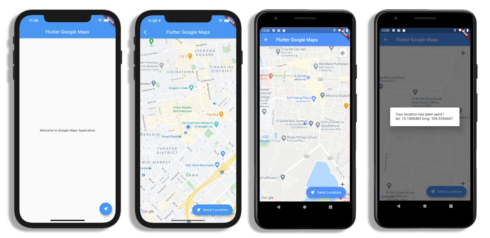

# Flutter GoogleMaps

พัฒนาโดย 

[อาจาย์พิศาล สุขขี](https://www.facebook.com/numvarn)

phisan.s@sskru.ac.th

สาขาวิทยาการคอมพิวเตอร์, คณะศิลปศาสตร์และวิทยาศาสตร์ มหาวิทยาลัยราชภัฏศรีสะเกษ

**Packages we are using:**

- google_maps_flutter: [link](https://pub.dev/packages/google_maps_flutter)
- geolocator: [link](https://pub.dev/packages/geolocator)

**Description:**

โมบายแอปพลิเคชั่นนี้พัฒนาขึ้นเพื่อใช้เป็นสื่อการเรียนการสอน และตัวอย่างในกรณีศึกษาการพัฒนาโมบายแอปพลิเคชั่นด้วย Flutter ในรายวิชาการพัฒนาโปรแกรมบนมือถือ

เพื่อให้นักศึกษาได้ใช้สำหรับการศึกษา ทดลองปฏิบัติตาม ให้เกิดความรู้ ความเข้าใจ และทักษะในการพัฒนาโปรแกรมบนมือถือด้วย Flutter

## เพิ่ม Dependencies ใน Flutter
```yaml
dependencies:
  flutter:
    sdk: flutter
  ..
  cupertino_icons: ^1.0.0
  geolocator: ^6.1.14
  google_maps_flutter: ^1.1.1
```

**การใช้งาน**
```dart
import 'package:geolocator/geolocator.dart';
import 'package:google_maps_flutter/google_maps_flutter.dart';
```

## เพิ่ม Google Maps API key ในโปรเจค

### สำหรับ Android

พอได้ api key แล้วก็ไปที่ android/app/src/main/AndroidManifest.xml เอา API key ไปใส่ไว้ในนี้ โดยเพิ่มเป็น <meta-data> และเพิ่ม permission สำหรับใช้งาน geolocator

```xml
<manifest ...
 
   <uses-permission android:name="android.permission.ACCESS_FINE_LOCATION" />
   <uses-permission android:name="android.permission.ACCESS_COARSE_LOCATION" />
 
  <application ...
    <meta-data android:name="com.google.android.geo.API_KEY"
               android:value="YOUR KEY HERE"/>
```

### สำหรับ iOS

สำหรับ iOS จะเพิ่ม API key ที่ ios/Runner/AppDelegate.swift

```swift
GMSServices.provideAPIKey("YOUR KEY HERE")
```

โดยเพิ่มที่

```swift
import UIKit
import Flutter
import GoogleMaps
 
@UIApplicationMain
@objc class AppDelegate: FlutterAppDelegate {
  override func application(
    _ application: UIApplication,
    didFinishLaunchingWithOptions launchOptions: [UIApplicationLaunchOptionsKey: Any]?
  ) -> Bool {
    GMSServices.provideAPIKey("YOUR KEY HERE")
    GeneratedPluginRegistrant.register(with: self)
    return super.application(application, didFinishLaunchingWithOptions: launchOptions)
  }
}
```

ปล. ห้ามลืม import GoogleMaps

```switf
import GoogleMaps
```

เพิ่ม permission ที่ ios/Runner/Info.plist

```swift
<plist version="1.0">
<dict>
	...
	<key>NSLocationWhenInUseUsageDescription</key>
	<string>This app needs your location to test the location feature of the Google Maps plugin.</string>
	<key>io.flutter.embedded_views_preview</key>
	<true/>
</dict>
</plist>
```

## Geolocator

การใช้งาน Geolocator สำหรับดึงพิกัดปัจจุบันของผู้ใช้งานจากโทรศัพท์ ด้วยการใช้งาน Future
```dart
class ... extends State<MapsPage> {
  Position userLocation;
  ..
  
  Future<Position> _getLocation() async {
    try {
      userLocation = await Geolocator.getCurrentPosition(
          desiredAccuracy: LocationAccuracy.best);
    } catch (e) {
      userLocation = null;
    }
    return userLocation;
  }
  ..

  @override
  Widget build(BuildContext context) {
    ..
```

## GoogleMap

### การสร้าง Map Controller
```dart
GoogleMapController mapController;

void _onMapCreated(GoogleMapController controller) {
  mapController = controller;
}
```

### ตัวอย่างการเรียกใช้ Wiget GoogleMap()
```dart
GoogleMap(
  mapType: MapType.normal,
  myLocationEnabled: true,
  onMapCreated: _onMapCreated,
  initialCameraPosition: CameraPosition(
      target: LatLng(13.7650836, 100.5379664),
      zoom: 15),
)
```

### ตัวอย่างการปรับตำแหน่งปัจจุบันบนแผนที่ด้วย animateCamera
```dart
mapController.animateCamera(CameraUpdate.newLatLngZoom(
              LatLng(userLocation.latitude, userLocation.longitude), 17));
```

## การแสดงผลแผนที่ผ่านหน้าจอ
การแสดงผลแผนที่ผ่านหน้าจอจะเป็นการใช้งาน FutureBuilder สำหรับการแสดงผล โดย แอปพลิเคชันจะทำการดึงพิกัดปัจจุบันของผู้ใช้งานก่อน และค่อยทำการแสดงผลแผนที่ ณ ตำแหน่งปัจจุบันของผู้ใช้งาน

```dart
..

body: FutureBuilder(
  future: _getLocation(),
  builder: (BuildContext context, AsyncSnapshot<dynamic> snapshot) {
    if (snapshot.hasData) {
      return GoogleMap(
        mapType: MapType.normal,
        myLocationEnabled: true,
        onMapCreated: _onMapCreated,
        initialCameraPosition: CameraPosition(
            target: LatLng(userLocation.latitude, userLocation.longitude),
            zoom: 15),
      );
    } else {
      return Center(
        child: Column(
          mainAxisAlignment: MainAxisAlignment.center,
          children: <Widget>[CircularProgressIndicator()],
        ),
      );
    }
  },
),

..
```

## แหล่งข้อมูลอ้างอิง

- Flutter : การใช้ Google Maps ใน Flutter [link](https://benzneststudios.com/blog/flutter/using-google-maps-in-flutter/)
- Working with Geolocation and Geocoding in Flutter (And Integration with Maps) [link](https://medium.com/swlh/working-with-geolocation-and-geocoding-in-flutter-and-integration-with-maps-16fb0bc35ede)

## ตัวอย่างหน้าจอ User Interface


